# Top 25 - Lifetime

-   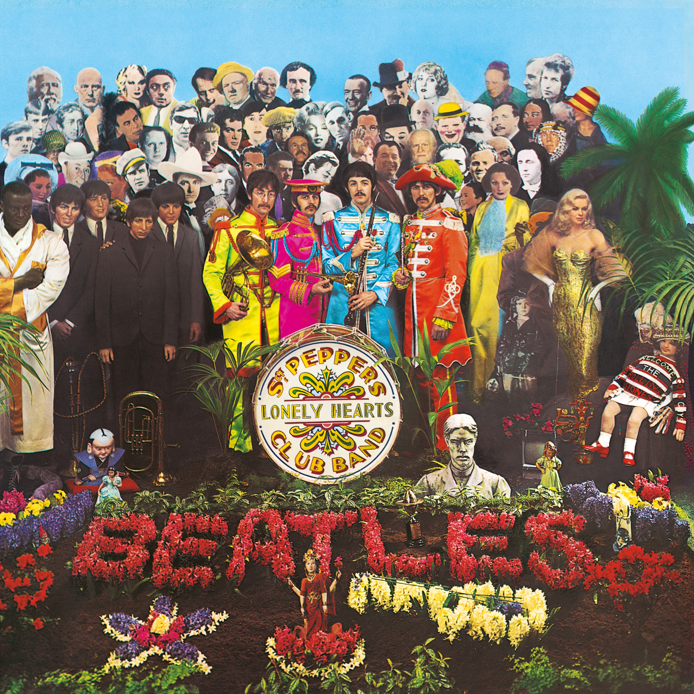{ .top-list-image }

    ## The Beatles - Sgt. Pepper's Lonely Hearts Club Band

-   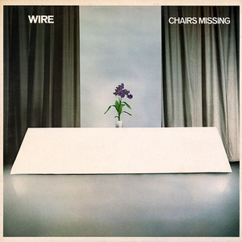{ .top-list-image }

    ## Wire - Chairs Missing

<!-- more -->

-   { .top-list-image }

    ## Fleetwood Mac - Rumours

-   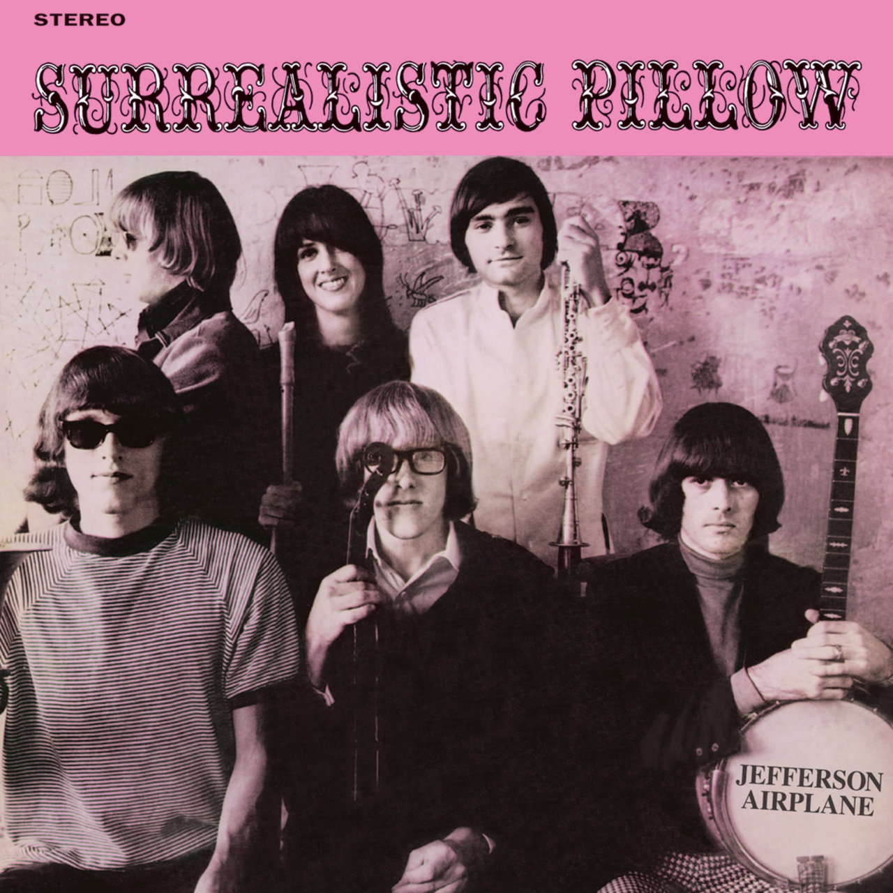{ .top-list-image }

    ## Jefferson Airplane - Surrealistic Pillow

-   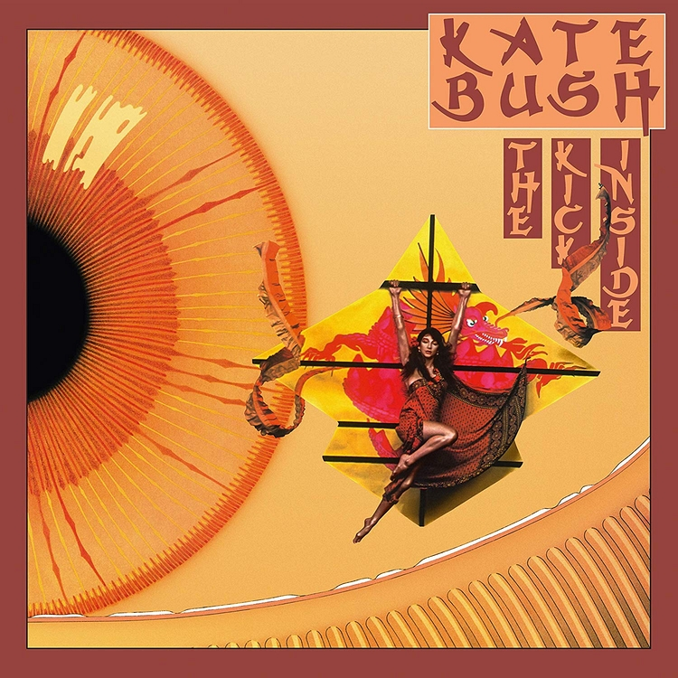{ .top-list-image }

    ## Kate Bush - The Kick Inside

-   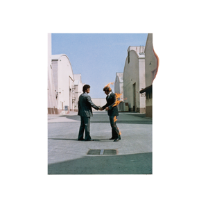{ .top-list-image }

    ## Pink Floyd - Wish You Were Here

-   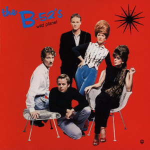{ .top-list-image }

    ## The B-52's - Wild Planet

-   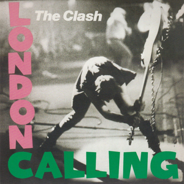{ .top-list-image }

    ## The Clash - London Calling

-   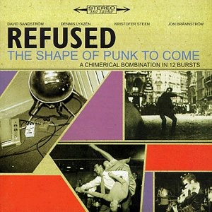{ .top-list-image }

    ## Refused - The Shape of Punk to Come

-   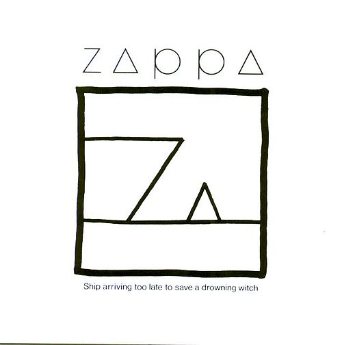{ .top-list-image }

    ## Frank Zappa - Ship Arriving Too Late to Save a Drowning Witch

-   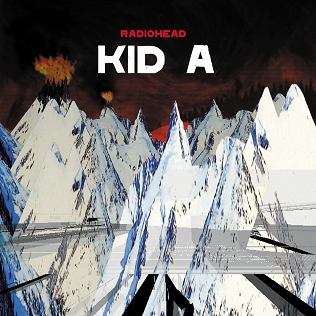{ .top-list-image }

    ## Radiohead - Kid A

-   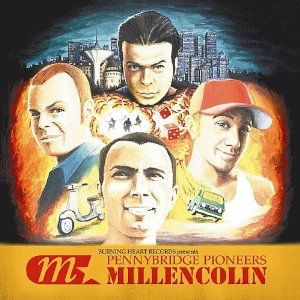{ .top-list-image }

    ## Millencolin - Pennybridge Pioneers

-   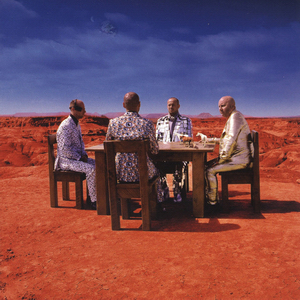{ .top-list-image }

    ## Muse - Black Holes and Revelations

-   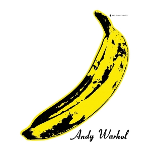{ .top-list-image }

    ## The Velvet Underground - The Velvet Underground & Nico

-   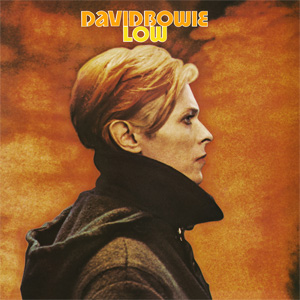{ .top-list-image }

    ## David Bowie - Low

-   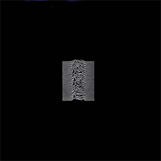{ .top-list-image }

    ## Joy Division - Unknown Pleasures

-   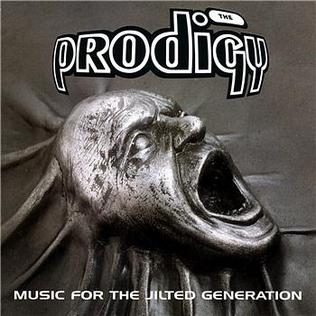{ .top-list-image }

    ## The Prodigy - Music for the Jilted Generation

-   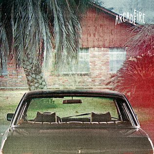{ .top-list-image }

    ## Arcade Fire - The Suburbs

-   { .top-list-image }

    ## Descendents - Milo goes to Collage

-   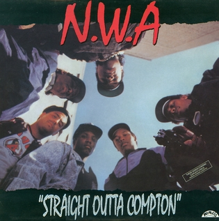{ .top-list-image }

    ## N.W.A. - Straight Outta Compton

-   { .top-list-image }

    ## Genesis - The Lamb Lies Down on Broadway

-   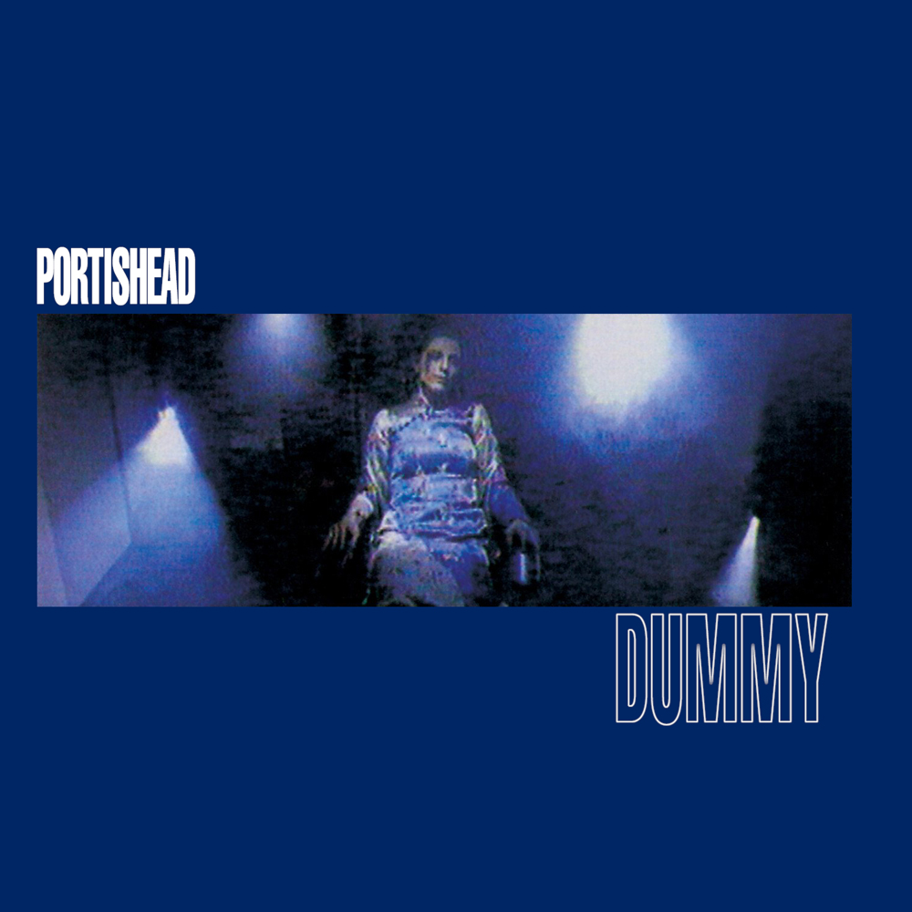{ .top-list-image }

    ## Portishead - Dummy

-   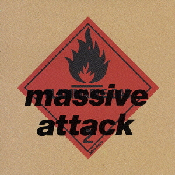{ .top-list-image }

    ## Massive Attack - Blue Lines

-   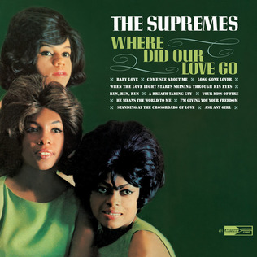{ .top-list-image }

    ## The Supremes - Where Did Our Love Go

-   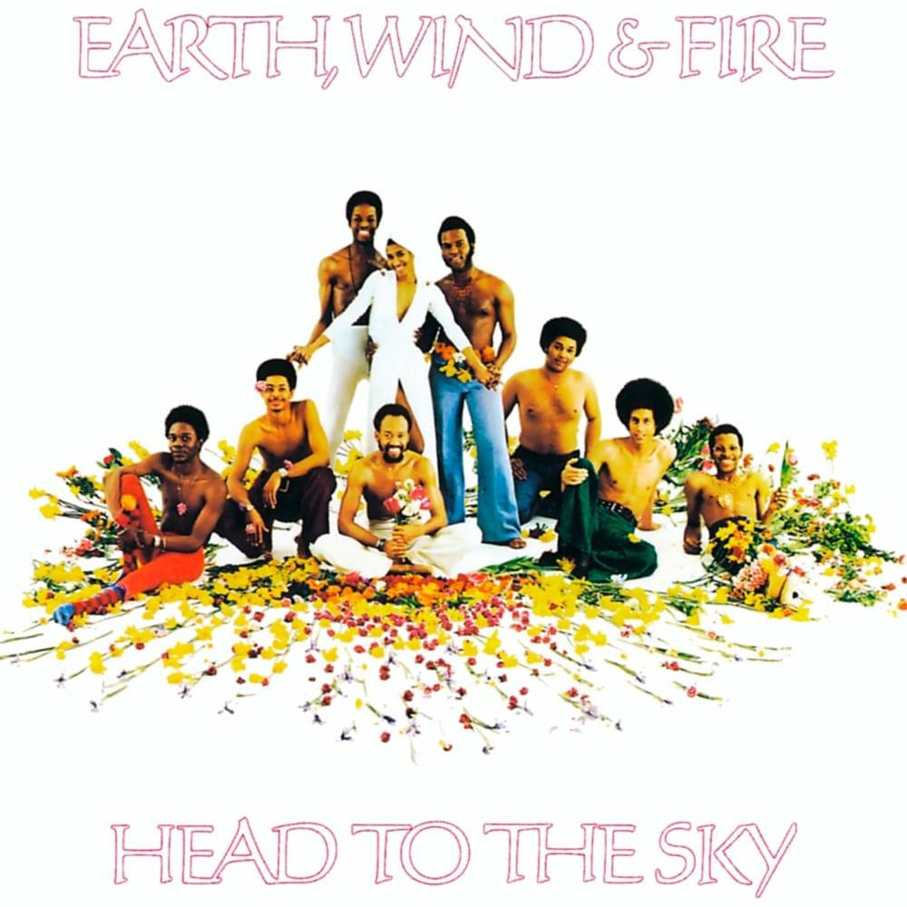{ .top-list-image }

    ## Earth, Wind & Fire - Head to the Sky

